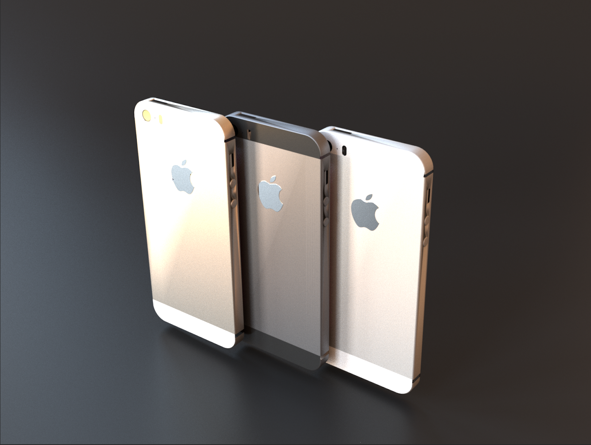
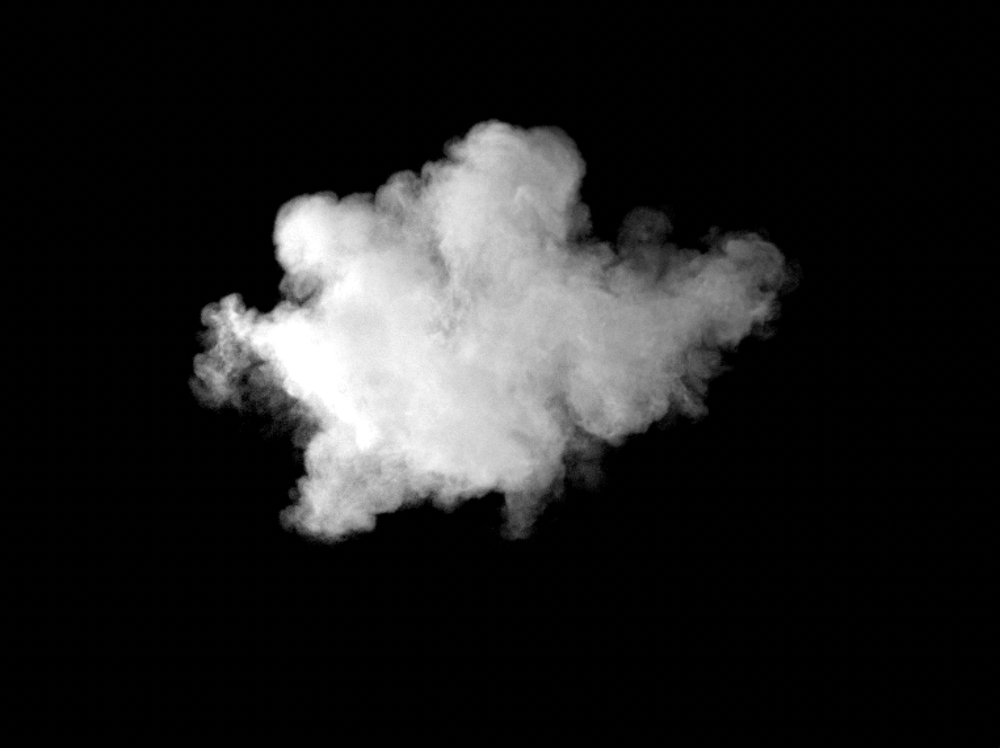
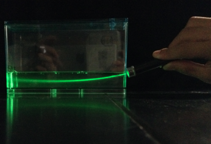
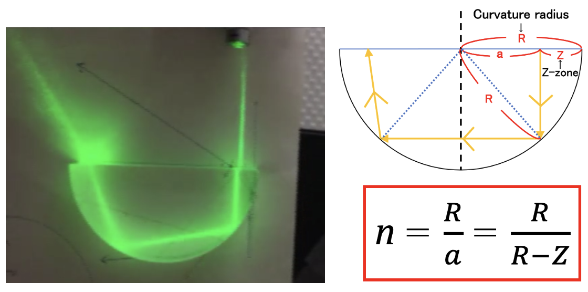
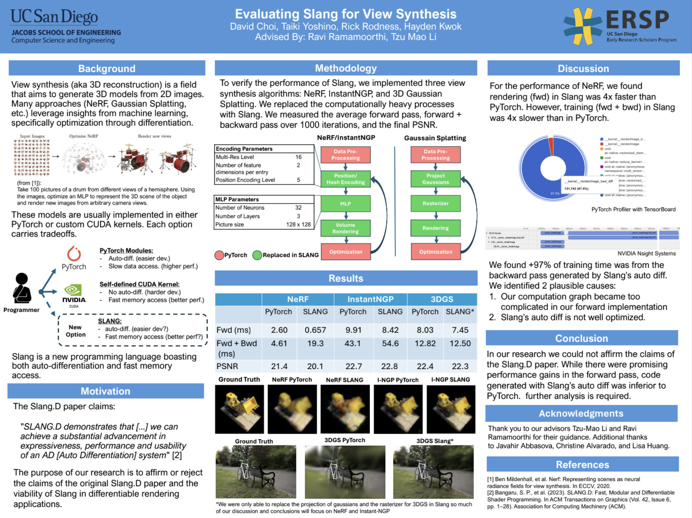
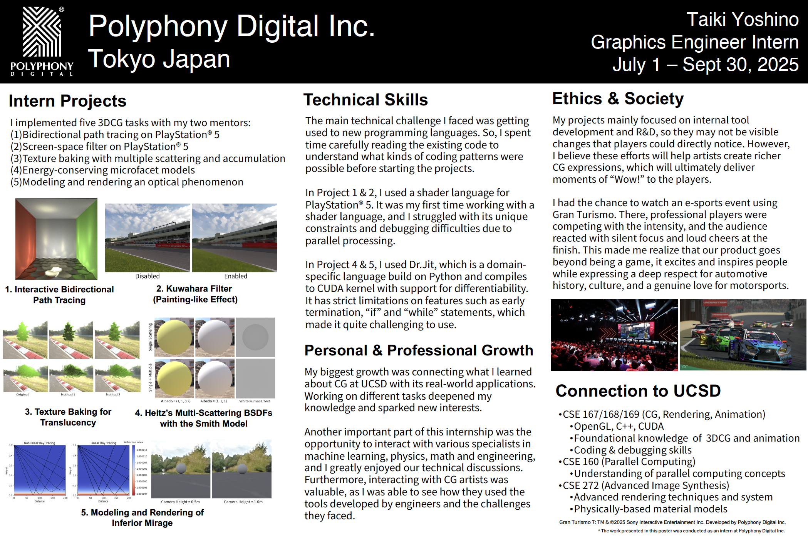
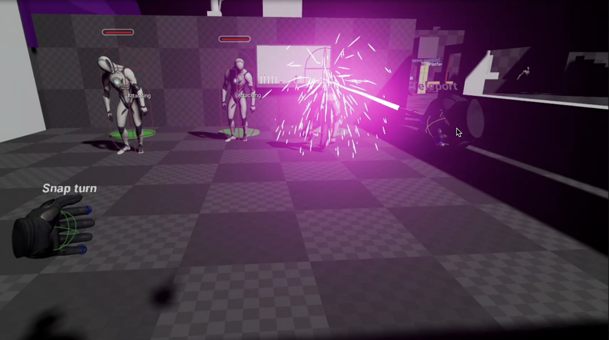

## Taiki Yoshino
I'm fourth-year CSE major student at UC San Diego.
[Project Page](https://tayoshino31.github.io/CG-Projects/)

## Course Projects

#### Mar 19, 2024 [Ray Tracing](https://tayoshino31.github.io/CG-Projects/pages/raytracing)
- Used Tools: C++, OpenGL
- Ray tracing from scratch
- Transformation of spheres and triangles
- A single point light source.
- Bounding Volume Hierarchy

&nbsp; 
&nbsp;  
&nbsp; 

#### Jun 11, 2024 [Physically Based Rendering](https://tayoshino31.github.io/CG-Projects/pages/rendering)
- Used Tools: C++, CUDA, OptiX 6.5, 
- Simple Path Tracing with GPU
- Area light sources
- Analitic & Monte Carlo solution
- Global Illumination
- Next Event Estimation
- Russian Roulette
- Importance Sampling

&nbsp; 
&nbsp;  
&nbsp;  

  

#### Feb 13, 2025 [Keyframe Animation]( https://tayoshino31.github.io/CG-Projects/pages/animation)

- Used Tools: C++, OpenGL, ImGUI 
- Skeleton and froward kinematics
- Character Skin
- Keyframe Animation
- Tangent Interpolation, 
- Extrapolation

&nbsp;  
&nbsp; 
&nbsp; 

  

#### Feb 27, 2025 [Cloth Simulation](https://tayoshino31.github.io/CG-Projects/pages/cloth)

- Used Tools: C++, OpenGL 
- Cloth made from Particles
- Uniform Gravity
- Spring Elasticity
- Damping
- Aerodynamic Drag
- Simple Ground Plane Collisions

&nbsp;  
&nbsp;  
&nbsp;

  

#### Mar 11, 2025 [SPH Fluids](https://tayoshino31.github.io/CG-Projects/pages/sph)

- Used Tools: C++, OpenGL
- Particle Based Fluid
- Navier-Stokes Equation
- Pressure, Viscosity, Gravity
- Neighbor Search with Uniform Grids
- Wall Plane Repulsion Collision

&nbsp; 
&nbsp;  
&nbsp;  

  

#### Jan 23, 2026 [Disny Principled BSDF]( )

- Used Tools: C++, lajolla renderer
- Diffuse
- Metal
- Clearcoat
- Glass
- Sheen

&nbsp;  
&nbsp; 
&nbsp;  

  

#### Feb 11, 2026 [Volumetric Path Tracing]( https://tayoshino31.github.io/CG-Projects/pages/vol)

- Used Tools: C++, lajolla renderer
- Multiple Scattering
- Homogeneous & Heterogeneous Media
- Next Event Estimation
- Multiple Importance Sampling
- Chromatic Media

&nbsp;  
&nbsp; 
&nbsp;  

## Research & Intern Project
  

#### June 5, 2019 [Mirage Simulation]()

- Physics Research on Hot Road Mirage
- Taiki Yoshino
- Advisors: Kajio Takihiro
- Super Science High School Program @ Uto High School
- Reproduced a parabola-like light path on a small scale.

&nbsp;  
&nbsp; 
&nbsp; 

  

#### March 1, 2020 [Refractive Index](https://drive.google.com/file/d/1GtNrVg-7XeD19hKKPpuD1Naawu1guImz/view)

- Physics Research on Refractive Index of Aqueous Solution
- Eito Kubota, Taiki Yoshino, Nanami Shikai
- Advisors: Kajio Takihiro
- Physics Club @ Uto High School
- Discovered a simple method for measuring   the refractive index & concentration of an aqueous solution.

&nbsp;  
&nbsp; 
&nbsp; 

  

#### Jun 11, 2024 [NeRF-Slang]( https://drive.google.com/file/d/1u5g0FRjUYAK6FVz_k3svPNv_KpK_LRgS/view)

- Evaluating Slang for View Synthesis
- David Choi, Taiki Yoshino, Rick Rodness, Hayden Kwok
- Advisors: Ravi Ramamoorthi, Tzu Mao Li
- Early Research Scholars Program @ UCSD
- Reimplementation of NeRF & 3DGS in a new shading language Slang.

&nbsp;  
&nbsp; 
&nbsp; 
&nbsp; 

  

#### Feb 27, 2025 [HotSpot](https://zeamoxwang.github.io/HotSpot-CVPR25/)

- HotSpot: Signed Distance Function Optimization   with an Asymptotically Sufficient Condition
- Zimo Wang, Cheng Wang, Taiki Yoshino, Sirui Tao, Ziyang Fu, Tzu-Mao Li
- CVPR 2025
- Neural SDF optimization with heat method.

&nbsp;  
&nbsp; 

<!--   

#### Sep 30, 2025 [PDI-Intern](https://internshipsymposium.ucsd.edu/images/2025.PPG.YOSHINO.TAIKI.png)

- Graphics Enginner Intern at Polyphony Digital
- Implementd five 3DCG tasks with my two mentors.   (Bidirectional Path Tracing, Screen-Space Filter, Texture Baking for    Translucency, Multi-Scattering BSDF,Rendering Mirage)

&nbsp;  
&nbsp; 
&nbsp;  
&nbsp; 

  

#### Dec 10, 2025 [QI-Intern](images/qi-intern/qi-intern.png)

- Game Development Intern at Qualcomm Institute
- Developed three VR mini-games using UE5.

&nbsp;  
&nbsp;  -->

## Links
<!-- 1. [Ray Tracing](https://tayoshino31.github.io/CG-Projects/pages/raytracing)
2. [Physically Based Rendering](https://tayoshino31.github.io/CG-Projects/pages/rendering)
3. [Computer Animation]( https://tayoshino31.github.io/CG-Projects/pages/animation)
4. [Particle Based Fluid Simulation]( https://tayoshino31.github.io/CG-Projects/pages/animation)
5. [Volumetric Path Tracing]( https://tayoshino31.github.io/CG-Projects/pages/animation)
6. [Disney Principled BSDF]( https://tayoshino31.github.io/CG-Projects/pages/animation)
7. [HotSpot](https://arxiv.org/abs/2411.14628)
8. [NeRF-Slang](https://drive.google.com/file/d/1u5g0FRjUYAK6FVz_k3svPNv_KpK_LRgS/view) -->
