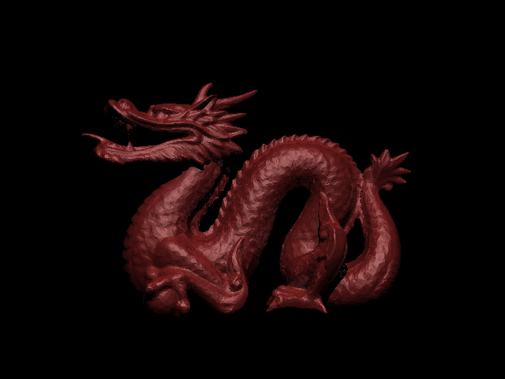
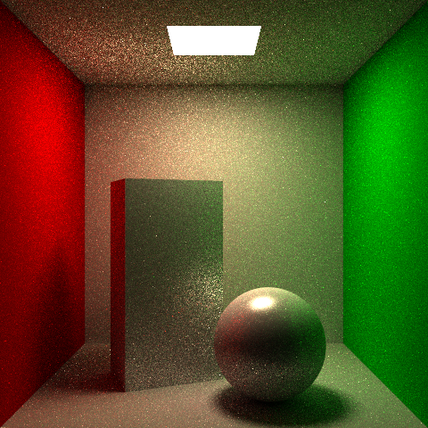
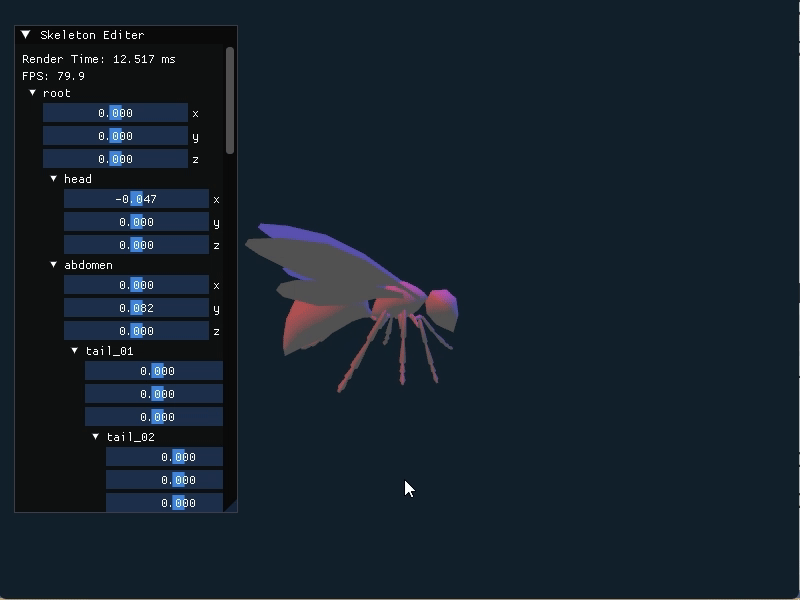
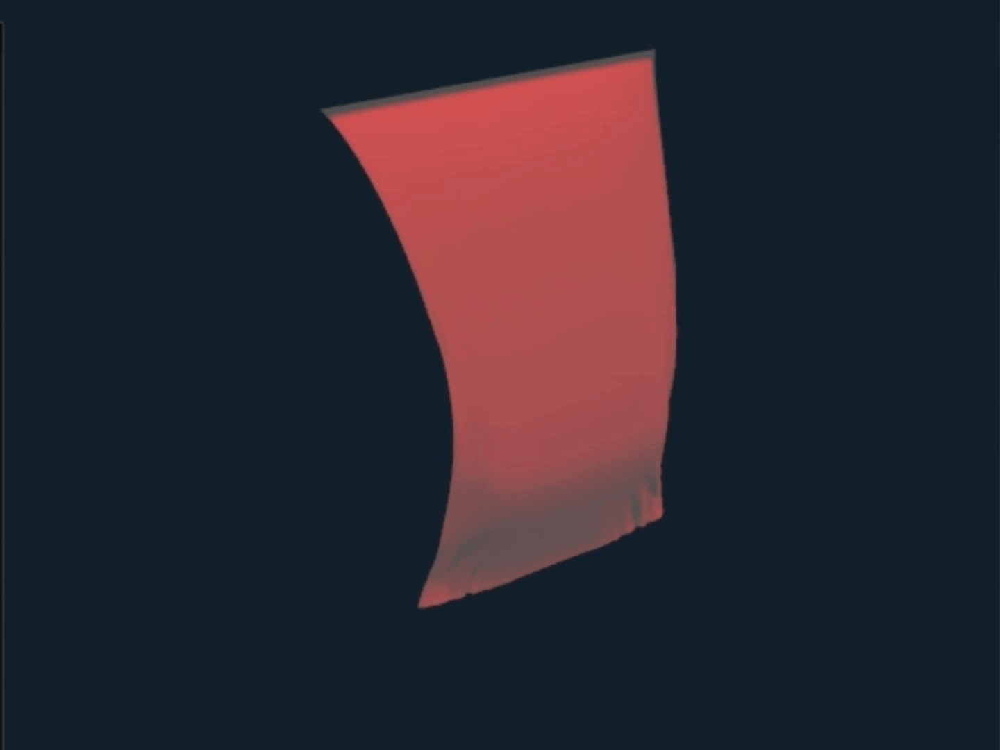
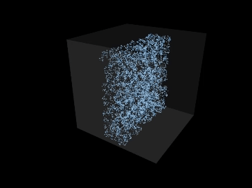
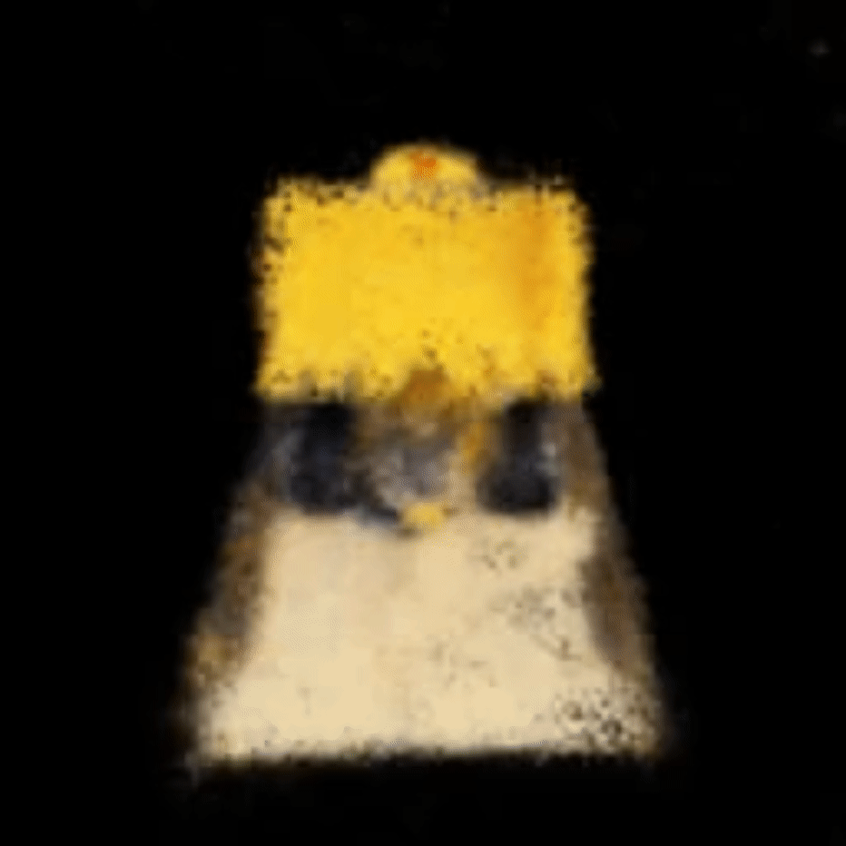
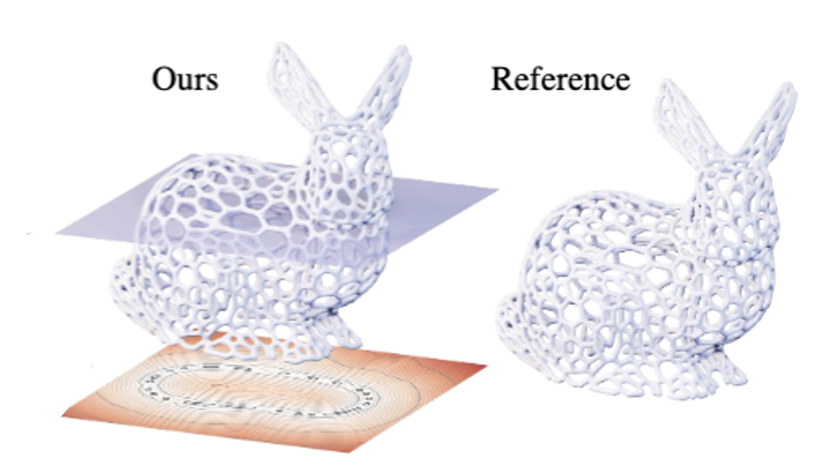

## Course Projects

#### Mar 19, 2024 [Ray Tracing](https://tayoshino31.github.io/CG-Projects/pages/raytracing)
- Used Tools: C++, OpenGL
- Ray tracing from scratch
- Transformation of spheres and triangles
- A single point light source.
- Bounding Volume Hierarchy

&nbsp; 
&nbsp;  
&nbsp; 

#### Jun 11, 2024 [Physically Based Rendering](https://tayoshino31.github.io/CG-Projects/pages/rendering)
- Used Tools: C++, CUDA, OptiX 6.5, 
- Simple Path Tracing with GPU
- Area light sources
- Analitic & Monte Carlo solution
- Global Illumination
- Next Event Estimation
- Russian Roulette
- Importance Sampling

&nbsp; 
&nbsp;  
&nbsp;  

  

#### Feb 13, 2025 [Keyframe Animation]( https://tayoshino31.github.io/CG-Projects/pages/animation)

- Used Tools: C++, OpenGL, ImGUI 
- Skeleton and froward kinematics
- Character Skin
- Keyframe Animation
- Tangent Interpolation, 
- Extrapolation

&nbsp;  
&nbsp; 
&nbsp; 

  

#### Feb 27, 2025 [Cloth Simulation]()

- Used Tools: C++, OpenGL 
- Cloth made from Particles
- Uniform Gravity
- Spring Elasticity
- Damping
- Aerodynamic Drag
- Simple Ground Plane Collisions

&nbsp;  
&nbsp;  
&nbsp;

  

#### Mar 9, 2025 [SPH Fluids]()

- Used Tools: C++, OpenGL
- Particle Based Fluid
- Navier-Stokes Equation
- Pressure, Viscosity, Gravity
- Neighbor Search with Uniform Grids
- Wall Plane Repulsion Collision

&nbsp; 
&nbsp;  
&nbsp;  

<!--   

#### Mar 1, 2025 [Particle Based Fluid Simulation]( https://tayoshino31.github.io/CG-Projects/pages/animation)

- CSE169 Final Project  
- Used Tools: C++, OpenGL, ImGUI, Visual Studio 2019
- ...
- ...
- ...

&nbsp;  
&nbsp; 
&nbsp;   -->

## Research Project
  

#### Jun 11, 2024 [NeRF-Slang]( https://drive.google.com/file/d/1u5g0FRjUYAK6FVz_k3svPNv_KpK_LRgS/view)

- Evaluating Slang for View Synthesis
- David Choi, Taiki Yoshino, Rick Rodness, Hayden Kwok
- Advisors: Ravi Ramamoorthi, Tzu Mao Li
- Early Research Scholars Program @ UCSD
- Reimplementation of NeRF & 3DGS in a new shading language Slang.

&nbsp;  
&nbsp; 

  

#### Feb 27, 2025 [HotSpot]( https://tayoshino31.github.io/CG-Projects/pages/animation)

- HotSpot: Signed Distance Function Optimization   with an Asymptotically Sufficient Condition
- Zimo Wang, Cheng Wang, Taiki Yoshino, Sirui Tao, Ziyang Fu, Tzu-Mao Li
- CVPR 2025
- Neural SDF optimization with heat method.

&nbsp;  
&nbsp; 

## Links
<!-- 1. [Ray Tracing](https://tayoshino31.github.io/CG-Projects/pages/raytracing)
2. [Physically Based Rendering](https://tayoshino31.github.io/CG-Projects/pages/rendering)
3. [Computer Animation]( https://tayoshino31.github.io/CG-Projects/pages/animation)
4. [Particle Based Fluid Simulation]( https://tayoshino31.github.io/CG-Projects/pages/animation)
5. [Volumetric Path Tracing]( https://tayoshino31.github.io/CG-Projects/pages/animation)
6. [Disney Principled BSDF]( https://tayoshino31.github.io/CG-Projects/pages/animation)
7. [HotSpot](https://arxiv.org/abs/2411.14628)
8. [NeRF-Slang](https://drive.google.com/file/d/1u5g0FRjUYAK6FVz_k3svPNv_KpK_LRgS/view) -->